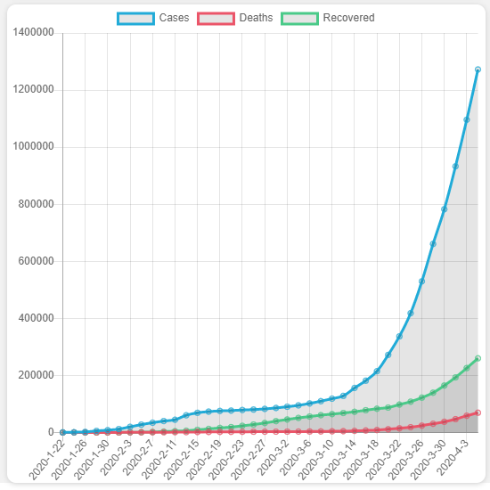
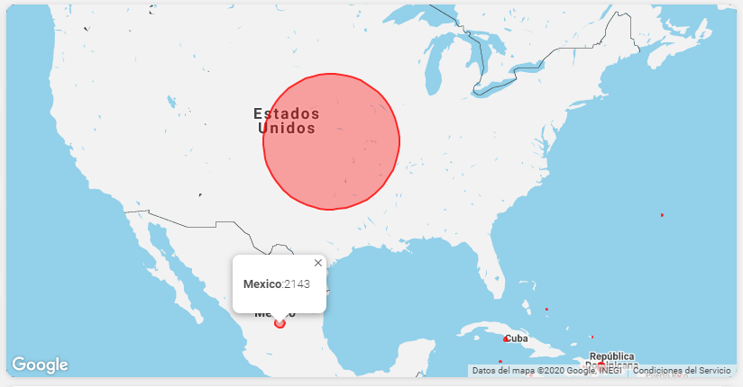
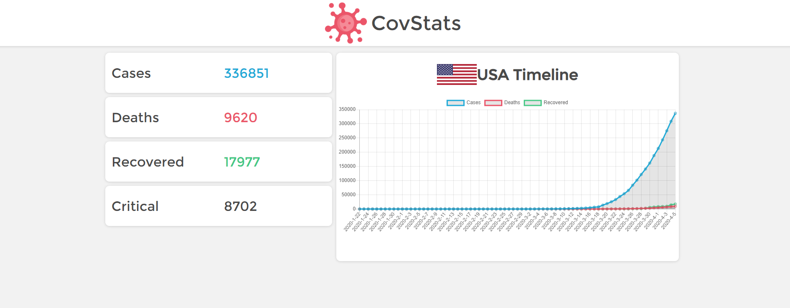

<h1 align="center">🦠 CovStats 📈</h1>

    

  #StayHome
    
## Covid-19 Dashboard with
<!-- UL -->
* Ember.js
* Chart.js
* GoogleMapsApi
* Vanilla CSS


## Screenshots







## Build the Ember project

```sh
npm i
```

```sh
npm run start
```

# API Endpoints

* https://corona.lmao.ninja/all
* https://corona.lmao.ninja/countries
* http://api.coronastatistics.live/timeline/global
* http://api.coronastatistics.live/timeline/country

#

This project was made by 💻 **Oscar Chapa** for SOFE 2020.

I had much fun this weekend 😄

Maded with ☕ and 💞


